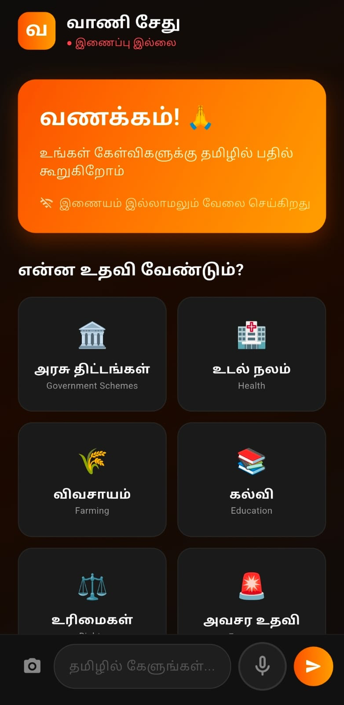

# வாணி சேது — VaaniSetu
## Tamil AI Assistant | Gemma 4 Good Hackathon 2026

VaaniSetu is a voice-first AI assistant designed to bridge the digital divide for Tamil Nadu's 70 million Tamil speakers. By leveraging the power of **Gemma 4** and **Ollama**, it provides an offline-first, native language experience for those who need it most.



---

## 🎯 The Vision
Most AI assistants are built for English speakers and require constant internet connectivity. For a farmer in Madurai or a grandmother in Thanjavur, these barriers make AI inaccessible. VaaniSetu provides:
- **Native Tamil Voice Interaction**: Talk to the AI as if you're talking to a friend.
- **Multimodal Vision**: Scan ration cards, prescriptions, or government notices to get instant Tamil explanations.
- **Offline Reliability**: Powered by local inference (Ollama), ensuring privacy and accessibility even in rural areas.

---

## 🚀 Download & Install

### Android (APK)
👉 **[Download VaaniSetu APK v1.1](release/vaanisetu_v1.0.apk)** *(Fixed connectivity version)*

1. Download the APK file to your phone.
2. Enable "Install from Unknown Sources" in settings.
3. Install and open the app.
4. **Note**: Ensure your phone is on the same Wi-Fi as the computer running the backend.

---

## 🛠️ Tech Stack

| Layer | Technology |
|-------|-----------|
| **AI Model** | Gemma 3 (4B) via Ollama |
| **Backend** | Python FastAPI |
| **Mobile App** | Flutter (Android) |
| **Voice Engine** | Speech-to-Text & TTS (Tamil Locale) |
| **Vision** | Gemma Multimodal analysis |

---

## 📁 Project Structure

```
vaanisetu/
├── backend/
│   ├── main.py              ← FastAPI server + Gemma integration
│   └── requirements.txt
├── vaanisetu_app/           ← Flutter Mobile Application
│   ├── lib/
│   │   ├── main.dart
│   │   ├── screens/         ← Home & Chat UI
│   │   └── services/        ← Chat & Speech logic
│   └── pubspec.yaml
├── release/                 ← Ready-to-install APKs
├── assets/                  ← Project images
└── data/
    └── tamil_kb/            ← Government schemes knowledge base
```

---

## 💻 Developer Setup (Mac M2/M3)

### 1. Start Ollama
Ensure Ollama is installed and the model is downloaded:
```bash
ollama run gemma3:4b
```

### 2. Run Backend
```bash
cd backend
source venv/bin/activate
pip install -r requirements.txt
python main.py --host 0.0.0.0 --port 8000
```

### 3. Run Flutter App
```bash
cd vaanisetu_app
flutter run
```

---

## 📱 Key Features
- **Voice-First**: Integrated mic button for hands-free Tamil chat.
- **Smart Topics**: Quick-access buttons for Agriculture, Health, and Government Schemes.
- **Image Scanning**: Take a photo of a document and have the AI explain it in simple Tamil.
- **TTS Support**: The AI reads out responses in natural-sounding Tamil.

---

## 🏆 Hackathon Tracks
- **Digital Equity & Inclusivity**
- **Ollama Special Prize**
- **Main Track**
